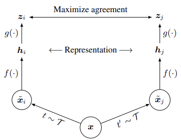
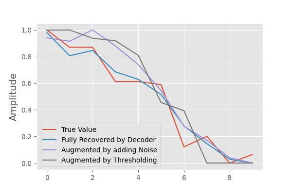
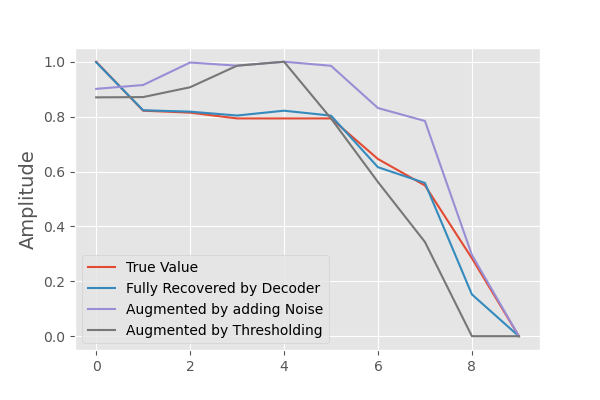
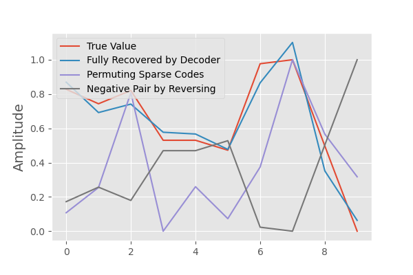
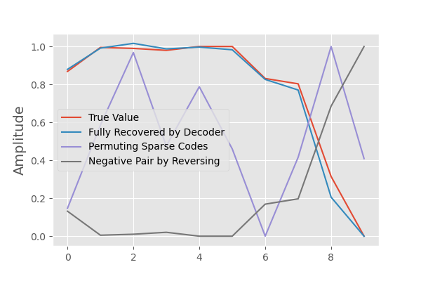
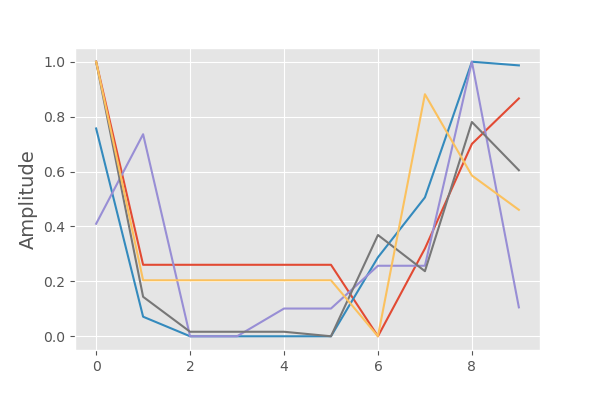
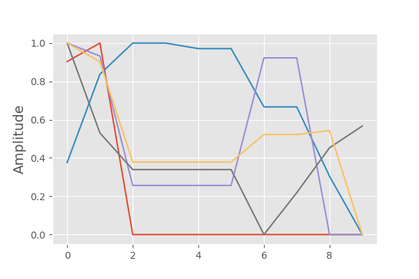

# Towards Contrastive Learning for Time-Series 


Semi-supervised learning and Contrastive Learning (CL) has gained a huge attention recently, thanks to the success gained by algorithms such as SimCLR [[1](https://arxiv.org/pdf/2002.05709.pdf), [2](https://arxiv.org/pdf/2003.04297.pdf)].

Contrastive learning is a learning paradigm where we want to learn distinctiveness. We want to learn what makes two objects similar or different. And if two things are similar, then we want the encodings for these two things to be similar as well. Algorithms like SimCLR learn representations by maximizing the agreement between differently augmented views of the same data example via contrastive loss in the latent space. 

These algorithms depend strongly on data augmentation and therefore are mostly focused on image representation, since producing meaningful augmented samples is reltaively easy in images compared to other data types. 




*Fig. 1: A simple framework for contrastive learning of visual representations. Two separate data augmentation operators are sampled from the same family of augmentations and applied to each data example to obtain two correlated views. A base encoder network f(·) and a projection head g(·) are trained to maximize agreement using a contrastive loss. After training is completed, we throw away the projection head g(·) and use encoder f(·) and representation h for downstream tasks - from [[1](https://arxiv.org/pdf/2002.05709.pdf)].*


In this blog post we explore a potential solution that extends the application of the contrastive learning to time-series using **sparse dictionary learning**. Sparse dictionary learning encodes the semantics of the data by learning dictionary atoms that can be used to sparsely encode the data. The core of our idea here is that using the sparse representation of the time-series, it can be augmented without loosing its semantics.

Our contrastive learning framework for time-series includes augmenting the data using sparse dictionary encoding and using contrastive loss to learn representations of the data. For contrastive learning we use Siamese Network [[3](https://leimao.github.io/article/Siamese-Network-MNIST/), [4](http://yann.lecun.com/exdb/publis/pdf/hadsell-chopra-lecun-06.pdf)], a classic contrastive learning network. By introducing multiple input channels in the network and appropriate loss functions, the Siamese Network is able to learn to represent similar inputs with similar embedding features and represent different inputs with different embedding features. 

## Sparse Dcitionary Learning

Dictionary learning aims at finding an over-complete set of dictionary atoms in which data admits a sparse representation. These dictionary atoms may not be orthogonal. The most important principle of the dictionary learning is that the atoms are learned from the data itself, which makes them different from DCT, Fourier transform, Wavelets transform, and other general signal representation algorithms. The dictionaries and the sparse representations are learned by solving the following optimization problem:
$$
argmin_{D, \alpha} \Sigma_{i=1}^K \| x_i - D\alpha_i  \|_2^2 + \lambda \| \alpha_i \|_0
$$
where we aim to represent the data $X=[x_1 , x_2, ..., x_K], x_i \in R^d$  using dictionary $D \in R^{d \times n}$ and representation $\alpha=[\alpha_1,...,\alpha_K], \alpha_i \in R^n$ such that $\|X - D \alpha \|^2_F$ is minimized and $\alpha$ is sparse enough. The level of sparsity is controled with $\lambda$ which is a positive regularization constatnt. The $\ell_0$ contraint can be relaxed to a convex $\ell_p$ norm. 

Solving this optimization problem usually is based on altering between solving for $D$ and $\alpha$, using methods like k-SVD [[5](https://sites.fas.harvard.edu/~cs278/papers/ksvd.pdf)], LASSO [[6](https://arxiv.org/pdf/0804.1302.pdf)], OMP [[7](https://openaccess.thecvf.com/content_iccv_2013/papers/Bao_Fast_Sparsity-Based_Orthogonal_2013_ICCV_paper.pdf)], ADMM [[8](http://ai.stanford.edu/~wzou/zou_bhaskar.pdf)] and FISTA [[9](https://people.rennes.inria.fr/Cedric.Herzet/Cedric.Herzet/Sparse_Seminar/Entrees/2012/11/12_A_Fast_Iterative_Shrinkage-Thresholding_Algorithmfor_Linear_Inverse_Problems_(A._Beck,_M._Teboulle)_files/Breck_2009.pdf)].

### Winner-Take-All Autoencoders

To learn the sparse dictionaries, we use auto-encoders and more specifically `Winner-Take-All Autoencoders` [[10](https://papers.nips.cc/paper/5783-winner-take-all-autoencoders.pdf)]. The idea is to learn an encoder and a decoder as we do in all autoencoders, but after computing the last feature maps of the encoder, rather than reconstructing the input from all of the hidden units of the feature maps, we identify the single largest hidden activity within each feature map, and set the rest of the activities as well as their derivatives to zero. 

This results in a sparse representation whose sparsity level is the number of feature maps. The decoder then reconstructs the output using only the active hidden units in the feature maps and the reconstruction error is only backpropagated through these hidden units as well.

After training, the encoder activity map is the sparse representaiton. In addition, if a shallow decoder is used, the weights of the decoder would be the atoms of the dictionary. 


*Fig. 2: Architecture for CONV-WTA autoencoder with spatial sparsity [[10](https://papers.nips.cc/paper/5783-winner-take-all-autoencoders.pdf)]*.


## Contrastive Learning Method

We use `Dimensionality Reduction by Learning an Invariant Mapping` (DrLIM)  [[4](http://yann.lecun.com/exdb/publis/pdf/hadsell-chopra-lecun-06.pdf)] for learning the representations and for unsupervised similar/unsimilar classification of the time-series. 

DrLIM learns a family of functions $G$ parameterized with $W$, i.e. neural networks, that maps the inputs to a manifold such that the eucleadian distance between the points in the manifold $D_W(x_1, x_2) = \|G_W(x_1) - G_W(x_2) \|_2$ approximates the similarity of the semantic meaning of $x_1$ and $x_2$. To achieve the goal for each input one pair of similar and one pair of unsimilar samples are created. If we have access to the labels of the data, the similar samples could be two samples from the same class and the unsimilar pair could be from two different classes. If we do not have access to the labels and the input data is an image, we can augment the input image (cropping, skewing, rotating, ...) to create the similar pair. However, creating the unsimilar pair is not as simple. For instance, we can assume that any other sample in the training batch is unsimilar. 

Creating the similar and unsimilar paths, we train a network that lables the similar pair by one, $Y=1$, and labels the unsimilar pair as zero, $Y=0$. To minimize the distance $D_W$ between the simialr samples and to maximize the distance between the unsimilar samples DrLIM uses the following loss function:
$$
L(W, Y, X_1, X_2) = (Y)(D_W)^2 + (1-Y)\{ min(0, m-D_W)^2 \}
$$
where $m>0$ is margin. Here, we assume $m=1$. 


*Fig. 3: Siamese Network [[3](https://leimao.github.io/article/Siamese-Network-MNIST/)]. $W$ is shared in two models*. 

## Proposed Algorithm

The proposed algorithm has two major steps:

1. Train a sparse autoencoder using Winner Takes All (WTA), with 1D convolutional layers. The training data is taken from sliced time-series data with a fixed length. 
   1. Use the latent sparse encoding (the encoder output) to create positive pairs by thresholding and adding noise to sparse representations. This creates pairs with similar semantics. 
   2. Use the latent sparse encoding to create negative pairs by randomly selecting the activation maps that are zero for the sample. This creates pairs with different semantics.
2. Use the positive and negative pairs to tarin a Siamese Network. 

The data used here is coming from Individual Conditional Expectation (ICE) plots [[11](https://christophm.github.io/interpretable-ml-book/ice.html)] of a model I was analysing and needed to cluster the similar ICE plots to make the interpretation of the model easier. The ICE plots could be thought of as short time-series. Although this is not an ideal data for representing time-series, it has an important factor that I am looking for here: the samples have similar contexts created by varying different features in the input data of the model that could be learned by dictionary learning.

 Here are few samples of the data:


*Fig 4.: Samples of the training data*


**Encoder**: The encoder has two 1D-Convolutional layers with 20 filters, kernel size of 5, and ReLU activations. 

```
Model: "Encoder"
_________________________________________________________________
Layer (type)                 Output Shape              Param #   
=================================================================
conv1d_1 (Conv1D)            (None, 10, 20)            120       
_________________________________________________________________
conv1d_2 (Conv1D)            (None, 10, 20)            2020      
_________________________________________________________________
lambda_1 (Lambda)            (None, 10, 20)            0         
=================================================================
Total params: 2,140
Trainable params: 2,140
Non-trainable params: 0
```

The Lambda layer in the encoder implements the WTA:

```python
def wtall(X):
    M = K.max(X, axis=(1), keepdims=True)
    R = K.switch(K.equal(X, M), X, K.zeros_like(X))
    return R
```

**Decoder**: Decoder has one of 1D-Convolutional layer with linear activation. Using a shallow decoder enables us to directly use its weights as the dictionary atoms. However, since we do not use the atoms separately this is not a necessary feature. However, since our data is simple here and to be able to plot the dictionary atoms we are going to use only one layer. 

```
Model: "Decoder"
_________________________________________________________________
Layer (type)                 Output Shape              Param #   
=================================================================
conv1d_3 (Conv1D)            (None, 10, 1)             101       
_________________________________________________________________
flatten_1 (Flatten)          (None, 10)                0         
=================================================================
Total params: 101
Trainable params: 101
Non-trainable params: 0
```

Combining the encoder and decoder, the structure of the autoencoer looks like:

```
Model: "WTA_AutoEncoder"
_________________________________________________________________
Layer (type)                 Output Shape              Param #   
=================================================================
Encoder (Sequential)    (None, 10, 20)            2140      
_________________________________________________________________
Decoder (Sequential)    (None, 10)                101       
=================================================================
Total params: 2,241
Trainable params: 2,241
Non-trainable params: 0
```


Here are the decoder wights that act as the dictionary atoms:


*Fig. 5: Decoder Kernel weights which are similar to the dictionary atoms.*


There are 20 filters which creates 20 dictionary atoms (creating a over-complete dictionary). The kernel width is 5 which means the length of each dictiotionary atom would be 5 too. As can be seen in Fig. 5 each of the atoms has learned a particular behaviour/contex, e.g. different ways that signal increases, decreases, or increases then decreases. 

Here is some examples of the positive pairs generated using sparse dictionary coding:






*Fig. 6: Some examples of positive pairs.*


As can be seen the true signal (red) and the one re-created by the decoder (blue) are very close. The two positive pairs resemble the global behaviour of the original signal while could be different enough to be used in contrastive learning. 

And this is how the negative pairs look like:






*Fig. 7: Some Examples of negative pairs.*


The generated negative pairs do not share the same context, meaning the overal behaviour of the negative pairs are completely different. 

Using the generated negative and positve pairs a Siamese Network is trained using equation (2). Here are some examples of the most similar samples based on the Siamese Network's output.





*Fig. 8: Examples of most similar samples according to the Siamese Network.*


As could be seen the network learns to find the samples with very similar behaviours. 

There are some failure cases too. For example Fig. 9 shows one of the samples and the similar pairs found by the model. 



*Fig. 9: samples with very different behaviours and similar representations in Siamese Network.*

## Limitations & Future Work

The main goal of this post is to sratrt a discussion about the possibility of using sparse coding for time-series augmentations. The framework we used here has many limitations. For instance, the training data may not be a good representitive of real time-series, due to its limited length and size. In addition, the model we used in Siamese Nework is a fully connected network (MLP), which is not the structure of the choice for the time-series models. To improve the framework, newer contrastive learning algorithms could be combined with recurrent models. 